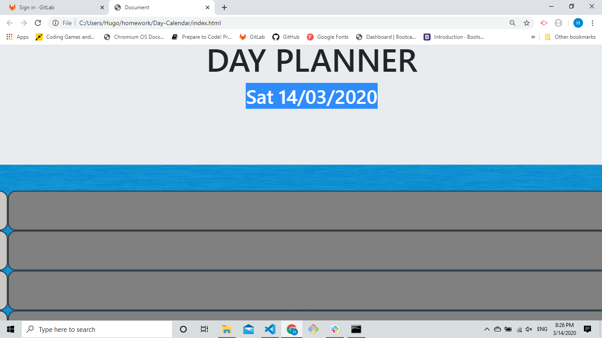
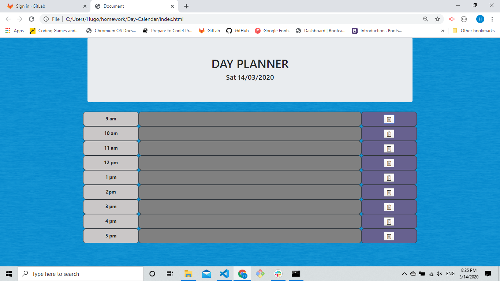

# Introduction

This is a simple Day Planner dynamically powered by Javascript. The time change according to the time, so past will be grey, present is red and future will be green... Also, users can add events for each hour that gets stored in Local Storage. 

## Instruction

1. The Day Planner is very simple to use. Bascically as soon as you open the page, you can see a title and the date.
 

 

2. The user will be able to click in the columns and a text area will be created where they will be able to input an event.
 

 

## What was used?

1. Bootstrap
2. Moment.js
3. Jquery
